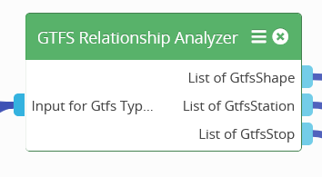
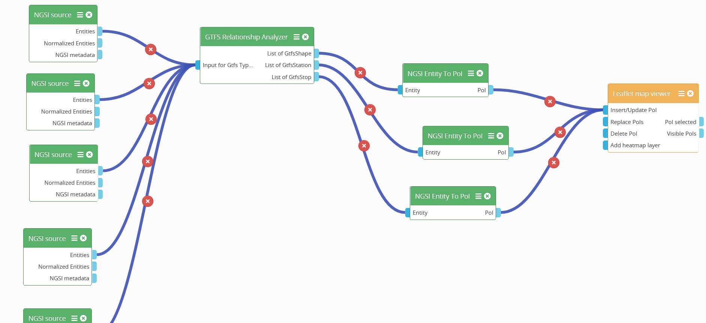

<h2 align="center">
  <a href="https://smart-maas.eu/en/"></a>
  <br>
      SMART MOBILITY SERVICE PLATFORM
  <br>
  <a href="https://smart-maas.eu/en/"></a>
  <br>
</h2>

<p align="center">
  <a href="mailto:info@smart-maas.eu">Contact</a> •
  <a href="https://github.com/SmartMaaS-Services/Transaction-Context-Manager/issues">Issues</a> •
  <a href="https://smart-maas.eu/en/">Project Page</a>
</p>


***

<h1 align="center">
  <a>
    GTFS Relationships Analyzer Operator
  </a>
</h1>

***


[](https://www.fiware.org/developers/catalogue/)

The gtfs relationship analyzer operator is a [WireCloud operator](http://wirecloud.readthedocs.org/en/latest/).
The GTFS Relationships Analyzer operator was created to visualize the data from the vbb-rest API interface in Wirecloud. 
The operator was conceptualized on the outputs from the repository [vbb-rest-2-ngsi](https://github.com/SmartMaaS-Services/vbb-rest-2-ngsi).

<p align="center">
    
</p>

The GTFS Relationships Analyzer operator was created to visualize the data from the vbb-rest API interface in Wirecloud. 
The operator was conceptualized on the outputs from the reopositry vbb-rest-2-ngsi.
The operator is used to link the individual GTFS entities that are related to each other, and then combine them into 
a unified entity.

## Example structure Wirecloud Wiring

<p align="center">
    
</p>

## Which widget to use for visualization
To visualize the data on a map, you can use the Wirecloud [Leaflet map viewer widget](https://github.com/SmartMaaS-Services/leaflet-map-widget), 
which has been extended with additional Leaflet plugins.


## Build dependencies

Be sure to have installed [Node.js](https://nodejs.org/) in your system. For example, you can install it on Ubuntu and Debian running the following commands:

```bash
sudo apt update; sudo apt install curl gnupg
curl -sL https://deb.nodesource.com/setup_8.x | sudo bash -
sudo apt install nodejs npm 
```

You also have to install the [Grunt](https://gruntjs.com/)'s command line interface (CLI):

```bash
sudo npm install -g grunt-cli
```

The remaining dependencies are installed using npm (you have to run this command
inside the folder where you downloaded this repository):

```bash
npm install
```


## Build

Once installed all the build dependencies you can build this operator by using grunt:

```bash
grunt
```

If everything goes well, you will find a wgt file in the `dist` folder.


## Documentation

Documentation about how to use this operator is available on the
[User Guide](src/doc/userguide.md). Anyway, you can find general information
about how to use operators on the
[WireCloud's User Guide](https://wirecloud.readthedocs.io/en/stable/user_guide/)
available on Read the Docs.

## Copyright and License

Copyright (c) 2020 FIWARE
Licensed under the MIT license.
